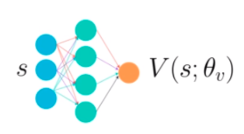

# Solved this environment using Actor Critic DDGP algorithm
### Actor-Critic Method
Actor model having low bias but high variance helps to avoid local maxima whereas critic model with low variance but high bias helps to make the learning faster. 
# Algorithm implementation details

# Algorithm works as given below
Algorithm has two different neural network.
# 1. Actor Class (Actor nural network)

Actor Class implemnts the neural network which consists of two fully connected (FC) hidden layers.
First FC late has 500 nodes connected to 33 input node while second Fully connected  layer has 400 nodes connected to output layer. Both of the Fully Connected layers have RELU activation function. The output layer for actor model has 4 nodes ranging between -1 to 1 therefore hyperbolic tangent is used for the activation function network also batch normalization as well as Xavier uniform weight initialization.

# 2. Critic Class (Critic neural network) 

Critic Class implemnts the neural network which consists of two fully connected (FC) hidden layers.
First FC late has 500 nodes connected to 33 input node and second Fully connected  layer has 400 nodes plus action_size connected to output layer. Both of the Fully Connected layers have RELU activation function. As output is liniar activation function network also uses batch normalization as well as Xavier uniform weight initialization.

# Step 1 How Logic works: 
Agent Interacts with the environment and gets the Reward and next_state 

Then the critic network is updated 

Then the actor network is updated.

### Replay Buffer
Replay Buffer is used to stores tuples of state, action, reward, next state and done flag of an experience once the replay buffer size is more then the Batch size then the learning takes place. To overcome the problem of co-relation sampling of the experience are sampled from the replay buffer randomly.

### Agent

The agent interacts with the environment and learns using Deep Deterministic Policy Gradient (DDPG) algorithm. Some features of DDPG algorithm being used are continuous action-space and soft update. Using soft update helps to reduce correlations. Soft update frequently updated the network with small fraction of the weights. During training, gradient clipping is also implemented into local critic model weights to avoid vanishing and exploding gradients.

### Training

Discount factor (gamma) for training is set high at 0.99 and the exploration value epsilon start at high value (1.0) but then gradually going 
down to 0.01. The target average score of 13 or higher in 100 episodes window was achieved in 472 episodes. The learning progress is shown below.
### Graph Score vs Episode
  

#### Avrage Score 

### Hyperparameters
The two most important things in order to achieve the target are to set Ornstein-Uhlenbeck noise sigma to 0.2 and implementing batch normalization. Without batch normalization and noise sigma of 0.2, the average score stacked at maximum of around +3. 
Adding batch normalization while still using noise sigma of 0.2 improved average score to around +8. 

### Future Work
Current implementation takes more than 250 episodes to solve. Modifying learning hyperparameters like soft update tau or learning rate for both actor and critic might help.