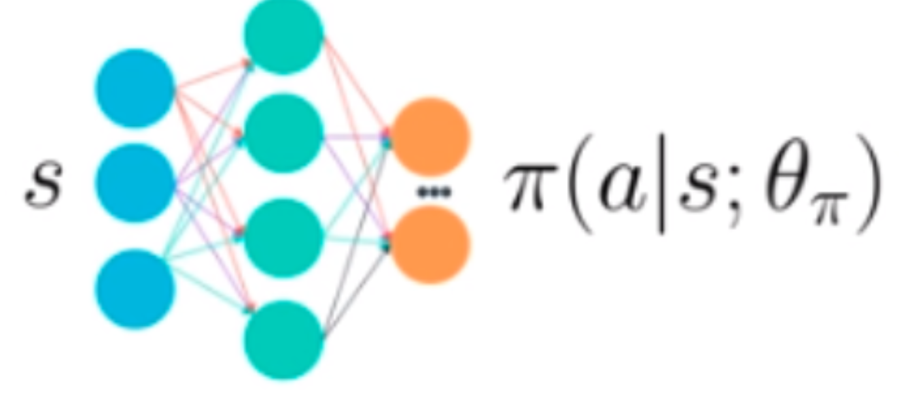
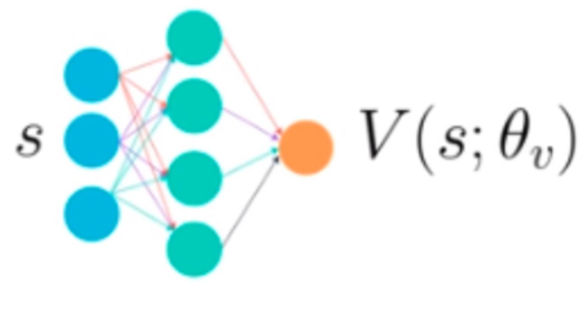
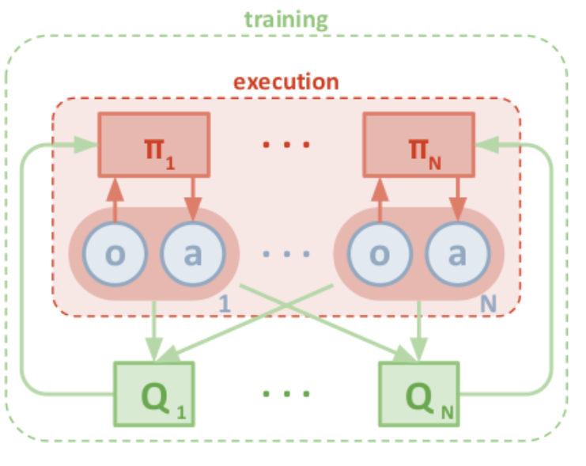
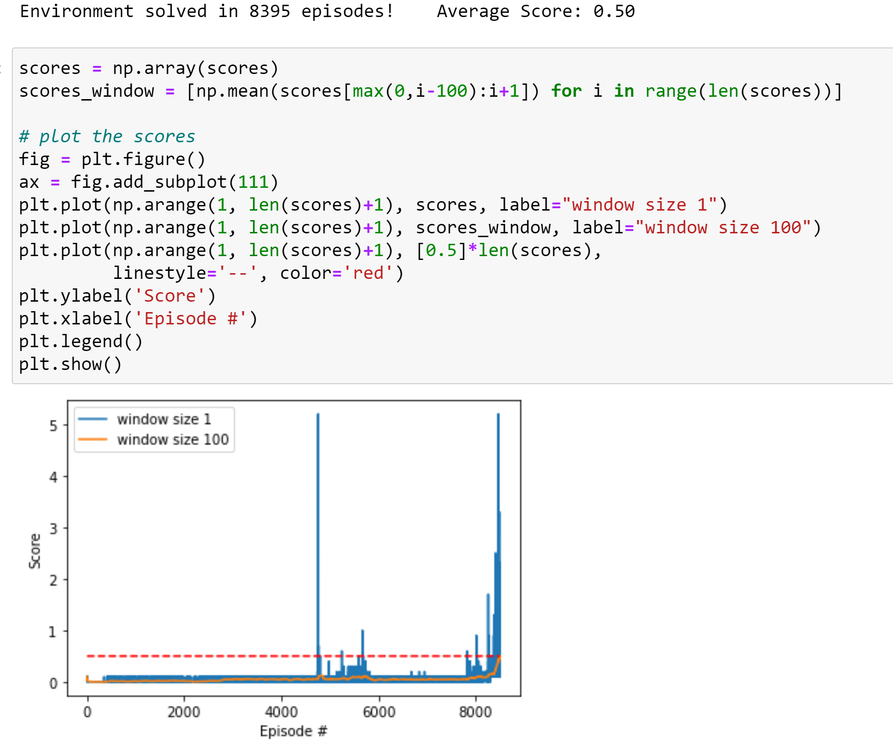

# Implementation

### Environment
Tennis environment has two agents working together in collaboration to achieve highest score. It receives actions from both agents and returns states, rewards and done flags for the both agents as well. 
Each action consists of two continuous values; 
horizontal Move :  Toward or Away from the net.
Vertival Move :  In the ground the action values are in between -1 and 1 thats why in the algorithm the output activation function is hyperbolic tangent. 
State : The states consists of 24 values observing the ball and each racket. Depending on the racket agent holds value will be different. This implementation also uses two different nural network policy policy for each agent and trains them separately. 
To solve this environment, the average score which is taken from the maximum reward of the two agents has to be +0.5 or higher over the past 100 episodes.
#########################

# Algorithm works as given below
Algorithm has two different neural network.
# 1. Actor Class (Actor nural network)

Actor Class implemnts the neural network which consists of three fully connected (FC) hidden layers.
First FC late has 512 nodes connected to 24 input node while second Fully connected  layer has 256 nodes connected third FC 128 nodes That is connected to output layer. All three Fully Connected layers have RELU activation function . The output layer for actor model has 2 nodes ranging between -1 to 1 therefore hyperbolic tangent is used for the activation function network also batch normalization as well as Xavier uniform weight initialization.

# 2. Critic Class (Critic neural network) 

Critic Class implemnts the neural network which consists of three fully connected (FC) hidden layers.
First FC late has 512 nodes connected to 24 input node while second Fully connected  layer has 256 nodes connected third FC 128 nodes That is connected to output layer. All three Fully Connected layers have RELU activation function . As output is liniar activation function network also uses batch normalization as well as Xavier uniform weight initialization.

Actor model input layer only focuses on the states of its corresponding agent. On the other hand, critic model input layer observes the states of both agents. Both actor and critic models utilize batch normalization and Xavier uniform weight initialization.

### Agent
Decentralized-actor means each actor learns from its own agent states and actions whereas centralized-critic means each critic learns from all agents states and actions. There is implementation that uses one neural networks model for all actors but this implementation uses one neural networks for each of the actors and trained separately.

To reduce correlations, this implementation uses randomly sampled replay buffer shared by both agents. It records states and actions taken by both agents. 
This implementation uses Deep Deterministic Policy Gradient (DDPG) algorithm to train multiple agents with decentralized-actor and centralized-critic method. 
Two types of clippings is also implemented. Gradient clipping is used to avoid vanishing and exploding gradients whereas action clipping is used to keep the actions within -1 and 1 due to noise injection.

### Training
This implementation updates the models 5 times at the end of each episode. The models reach the maximum score of +0.52 in 100 episodes window within 7678 episodes. Each episode score and the average score in 100 episodes window are shown below.

### Hyperparameters
Following Hyperparameters are used 

BUFFER_SIZE = int(1e6)     # replay buffer size
BATCH_SIZE = 128           # minibatch size
GAMMA = 0.99               # discount factor
TAU = 1e-3                 # for soft update of target parameters
SEED = 3                   # random seed
LR_ACTOR = 1e-4            # learning rate of the actor 
LR_CRITIC = 1e-3           # l earning rate of the critic
WEIGHT_DECAY = 0           # L2 weight decay
SIGMA = 0.1                # standard deviation for noise

### Future Work
As the environment is solved in 8395 episode trying to reduce the number of episode.
currently the algorithm uses decentralized-actor means each actor learns from its own agent states and actions with centralized-critic means each critic learns from all agents states and actions.
I am thinking to introduce another memory buffer to store each agents actor states and action so the actors can have some understanding among them on the other actors states and actions. 

